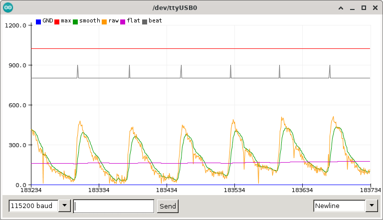
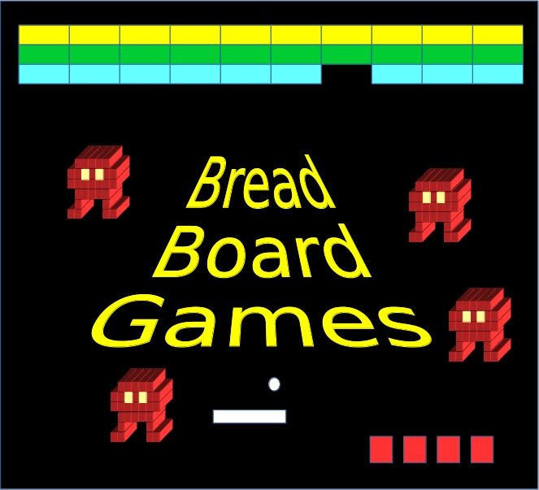

  
|[Home](README.md) | [PROJECTS & ACTIVITIES](ACTIVITIES.md) | [Who Are We?](WHOAREWE.md) |  [Blog](BLOG.md) |

|Activity          | Description                                    | image                   |    
|:----------------:|------------------------------------------------|:-----------------------:|
|[Dublin Maker](http://www.dublinmaker.ie)|For the past 10 years, we have participated in this brilliant annual event||
|[RoboSlam](https://roboslam.wordpress.com)|The original STEM activity that led to the development of STEM Ensemble was our first RoboSlam workshop in the Science Gallery Make Shop in 2012. We have also run this event at numerous arts festivals and science week events across the country and abroad. ||
|[Bioslam PPG](https://roboslam.wordpress.com/bioslam-ppg/)|An activity that we run each year for TY students during Engineers Week||
|[Breadboard Games](https://ioprog.com/bbg/)|Another "making" activity that we ran in all Co. Wexford libraries in summer 2017||
|[Grangegorman Alien Mystery](https://www.youtube.com/watch?v=Xjp_6gJGkB8)| An event that we developed for Revealing Grangegorman and the Stoneybatter Festival in 2023||
|[Quad Quest](https://www.tudublin.ie/explore/faculties-and-schools/engineering-built-environment/electrical-and-electronic-engineering/news-events-awards/news/revealing-grangegorman-family-day---alien-mystery.html)| An event that we coordinated during Revealing Grangegorman 2023, it allowed families with young children to directly experience STEM activities||

